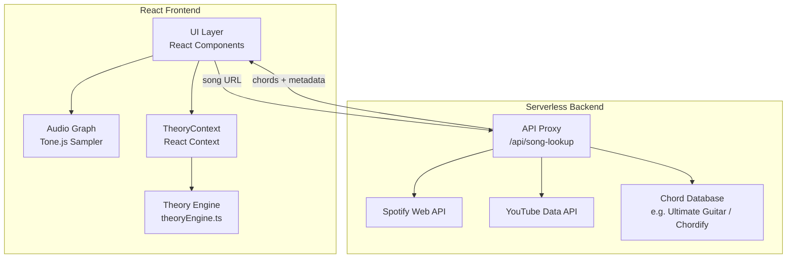

# Design: Fretboard Theory Workbench

## Overview

The Fretboard Theory Workbench extends the existing Guitar Chord Practice app into a comprehensive music theory learning tool. It adds scale/mode visualization, chord-scale relationship mapping, song analysis with Roman numeral notation, multi-position voicings, CAGED system integration, chord progression playback, song import via URL, and beginner-focused learning features — all built on the existing React 18 + TypeScript + Vite + Tailwind + shadcn/ui + Tone.js stack.

The design preserves the existing `FretboardVisualizer`, `PianoVisualizer`, `ChordVisualizer`, and audio infrastructure while introducing new modules for music theory computation, song analysis, and a lightweight backend for external API proxying.

### Key Design Decisions

1. **Pure music theory engine**: All scale/chord/interval computation lives in a standalone `theoryEngine.ts` module with zero UI dependencies — enabling property-based testing and reuse.
2. **Serverless backend for song import**: A lightweight serverless function (e.g., Vercel/Netlify function or AWS Lambda) handles Spotify Web API calls, YouTube title parsing, and chord database lookups — keeping API keys server-side and avoiding CORS issues.
3. **Existing state management**: Continue with React `useState`/`useRef` — the app's state complexity doesn't warrant Redux/Zustand. Lift shared theory state to a `TheoryContext` provider.
4. **Progressive enhancement**: Beginner features (learning path, finger placement, chord transitions) are additive overlays on existing components, not replacements.

## Architecture



### Module Boundaries

| Module | Responsibility | Dependencies |
|--------|---------------|-------------|
| `theoryEngine.ts` | Scale/mode generation, chord formula application, interval math, Roman numeral analysis, CAGED position mapping | None (pure functions) |
| `songAnalyzer.ts` | Key detection from chord list, Roman numeral conversion, progression extraction | `theoryEngine.ts` |
| `audioPlayer.ts` | Chord progression playback, tempo control, metronome | Tone.js |
| `TheoryContext.tsx` | Shared state: selected key, scale, mode, tuning, CAGED position | React Context |
| `api/song-lookup.ts` | Serverless function: URL parsing, Spotify/YouTube metadata fetch, chord DB search | External APIs |

## Components and Interfaces

### New Components


#### ScaleVisualizer
Renders scale/mode patterns on the fretboard SVG. Extends the existing `FretboardVisualizer` by accepting scale degree data and interval color mappings.

```typescript
interface ScaleVisualizerProps {
  rootNote: Note;
  scale: ScaleType;
  mode: number; // 0-indexed mode of the scale
  tuning: Tuning;
  isLeftHanded: boolean;
  highlightedDegrees?: number[]; // optional: highlight specific scale degrees
  cagedPosition?: CAGEDShape; // optional: constrain to CAGED position
  onNoteClick?: (note: Note, fret: number, string: number) => void;
}
```

#### ChordShapeOverlay
Overlays triad/chord shapes on the fretboard within a scale context, showing how chords are built from scale degrees.

```typescript
interface ChordShapeOverlayProps {
  chord: ChordFormula;
  position: FretboardPosition;
  scaleContext?: ScaleData; // when present, colors notes by scale degree
  showFingerNumbers?: boolean;
  showIntervalLabels?: boolean;
}
```

#### SongAnalysisPanel
Accepts a song's chord progression and displays key detection results, Roman numeral analysis, and chord-scale relationships.

```typescript
interface SongAnalysisPanelProps {
  chords: ChordSymbol[];
  detectedKey: KeySignature;
  romanNumerals: RomanNumeralEntry[];
  onKeyOverride?: (key: KeySignature) => void;
  onChordSelect?: (chord: ChordSymbol) => void;
}
```

#### SongImportDialog
Modal dialog for entering a Spotify/YouTube URL. Handles the async lookup flow with loading/error states.

```typescript
interface SongImportDialogProps {
  isOpen: boolean;
  onClose: () => void;
  onSongLoaded: (song: SongData) => void;
}
```

#### ProgressionPlayer
Playback controls for chord progressions with tempo, loop, and instrument selection.

```typescript
interface ProgressionPlayerProps {
  progression: ChordSymbol[];
  voicings: Voicing[];
  tempo: number; // BPM
  isPlaying: boolean;
  onTempoChange: (bpm: number) => void;
  onPlayPause: () => void;
  instrument: InstrumentType;
}
```

#### CAGEDPositionSelector
Visual selector for CAGED system positions, showing the 5 shapes and their fretboard regions.

```typescript
interface CAGEDPositionSelectorProps {
  rootNote: Note;
  selectedShape: CAGEDShape;
  onShapeSelect: (shape: CAGEDShape) => void;
}
```

#### UnifiedTheoryView
Combines scale visualization, chord shapes, and CAGED positions into a single view showing scale-chord relationships.

```typescript
interface UnifiedTheoryViewProps {
  rootNote: Note;
  scale: ScaleType;
  mode: number;
  selectedChordDegree?: number; // which scale degree chord to highlight
  cagedPosition?: CAGEDShape;
  tuning: Tuning;
  isLeftHanded: boolean;
}
```

#### LearningPathPanel
Guided learning experience with progressive lessons, finger placement guides, and chord transition training.

```typescript
interface LearningPathPanelProps {
  currentLevel: LearningLevel;
  completedLessons: string[];
  onLessonSelect: (lessonId: string) => void;
}
```

#### FingerPlacementGuide
Animated overlay showing correct finger positions for chords, with numbered fingerings and pressure indicators.

```typescript
interface FingerPlacementGuideProps {
  chord: ChordFormula;
  voicing: Voicing;
  showAnimation: boolean;
  playbackSpeed: number; // 0.5x to 2x
}
```

#### ChordTransitionTrainer
Practice tool for transitioning between two chords with timing feedback.

```typescript
interface ChordTransitionTrainerProps {
  fromChord: ChordSymbol;
  toChord: ChordSymbol;
  targetBPM: number;
  onTransitionComplete: (timing: TransitionMetrics) => void;
}
```

### Modified Existing Components

- **FretboardVisualizer**: Add props for `scaleOverlay`, `cagedRegion`, `fingerGuide` to support new visualization modes without breaking existing chord practice functionality.
- **SetupScreen**: Add navigation to Theory Workbench mode alongside existing Practice mode.
- **PracticeScreen**: Add "Analyze" button to send current chord progression to SongAnalysisPanel.

### TheoryContext Provider

```typescript
interface TheoryState {
  rootNote: Note;
  scale: ScaleType;
  mode: number;
  tuning: Tuning;
  isLeftHanded: boolean;
  cagedPosition: CAGEDShape | null;
  selectedChordDegree: number | null;
  songData: SongData | null;
}
```

Wraps the app at the top level, providing shared theory state to all new components. Existing components continue using their local state — no migration required.

## Data Models

### Core Theory Types

```typescript
// Notes and intervals
type NoteName = 'C' | 'C#' | 'D' | 'D#' | 'E' | 'F' | 'F#' | 'G' | 'G#' | 'A' | 'A#' | 'B';
type Note = { name: NoteName; octave: number };
type Interval = number; // semitones from root (0-11)

// Scales and modes
type ScaleType = 'major' | 'natural_minor' | 'harmonic_minor' | 'melodic_minor' | 'pentatonic_major' | 'pentatonic_minor' | 'blues' | 'dorian' | 'phrygian' | 'lydian' | 'mixolydian' | 'locrian';

interface ScaleData {
  root: NoteName;
  type: ScaleType;
  intervals: Interval[];
  notes: NoteName[];
  degrees: ScaleDegree[];
}

interface ScaleDegree {
  degree: number; // 1-7
  note: NoteName;
  quality: 'major' | 'minor' | 'diminished' | 'augmented';
  romanNumeral: string; // e.g. "I", "ii", "iii°"
}

// Chords
interface ChordFormula {
  name: string;
  symbol: string; // e.g. "Cmaj7", "Dm"
  intervals: Interval[];
  root: NoteName;
  quality: ChordQuality;
}

type ChordQuality = 'major' | 'minor' | 'diminished' | 'augmented' | 'dominant7' | 'major7' | 'minor7' | 'sus2' | 'sus4';
type ChordSymbol = string; // e.g. "Am", "G7", "Fmaj7"

// Fretboard positions
interface Voicing {
  strings: (number | null)[]; // fret number per string, null = muted
  fingers: (number | null)[]; // finger number per string
  barreAt?: number; // barre fret if applicable
  positionStart: number; // lowest fret in the voicing
}

interface FretboardPosition {
  startFret: number;
  endFret: number;
  voicing: Voicing;
}

// CAGED system
type CAGEDShape = 'C' | 'A' | 'G' | 'E' | 'D';

interface CAGEDPosition {
  shape: CAGEDShape;
  rootNote: NoteName;
  fretRange: [number, number];
  scalePattern: FretboardPosition;
  chordVoicing: Voicing;
}

// Tuning
interface Tuning {
  name: string;
  strings: Note[]; // from lowest to highest pitch
}

const STANDARD_TUNING: Tuning = {
  name: 'Standard',
  strings: [
    { name: 'E', octave: 2 },
    { name: 'A', octave: 2 },
    { name: 'D', octave: 3 },
    { name: 'G', octave: 3 },
    { name: 'B', octave: 3 },
    { name: 'E', octave: 4 },
  ],
};
```

### Song Analysis Types

```typescript
interface SongData {
  title: string;
  artist: string;
  sourceUrl: string;
  chords: ChordSymbol[];
  sections?: SongSection[];
}

interface SongSection {
  name: string; // "Verse", "Chorus", "Bridge"
  chords: ChordSymbol[];
}

interface KeySignature {
  root: NoteName;
  quality: 'major' | 'minor';
  confidence: number; // 0-1
}

interface RomanNumeralEntry {
  chord: ChordSymbol;
  numeral: string; // "I", "IV", "vi", etc.
  degree: number;
  function: HarmonicFunction;
  isSecondary?: boolean;
  isBorrowed?: boolean;
}

type HarmonicFunction = 'tonic' | 'subdominant' | 'dominant' | 'predominant';
```

### Song Import API Types

```typescript
// Request to serverless function
interface SongLookupRequest {
  url: string; // Spotify or YouTube URL
}

// Response from serverless function
interface SongLookupResponse {
  success: boolean;
  song?: SongData;
  error?: string;
  source: 'spotify' | 'youtube';
  chordSource: 'ultimate_guitar' | 'chordify' | 'chord_ai' | 'manual';
}
```

### Learning / Beginner Types

```typescript
type LearningLevel = 'beginner' | 'intermediate' | 'advanced';

interface Lesson {
  id: string;
  title: string;
  level: LearningLevel;
  description: string;
  steps: LessonStep[];
  prerequisites: string[]; // lesson IDs
}

interface LessonStep {
  instruction: string;
  chord?: ChordSymbol;
  voicing?: Voicing;
  expectedAction: 'view' | 'play' | 'transition';
}

interface TransitionMetrics {
  fromChord: ChordSymbol;
  toChord: ChordSymbol;
  timeMs: number;
  accuracy: number; // 0-1 based on clean transition
  targetBPM: number;
}
```

### Theory Engine Interface (Pure Functions)

```typescript
// theoryEngine.ts — all pure, no side effects
function getScaleNotes(root: NoteName, scaleType: ScaleType): NoteName[];
function getScaleIntervals(scaleType: ScaleType): Interval[];
function getModeFromScale(scaleType: ScaleType, modeIndex: number): Interval[];
function getScaleDegreeChords(root: NoteName, scaleType: ScaleType): ScaleDegree[];
function buildChord(root: NoteName, quality: ChordQuality): ChordFormula;
function transposeNote(note: NoteName, semitones: number): NoteName;
function noteToMidi(note: Note): number;
function midiToNote(midi: number): Note;
function getCAGEDPositions(root: NoteName): CAGEDPosition[];
function getVoicingsForChord(chord: ChordFormula, tuning: Tuning, maxFret?: number): Voicing[];
function detectKey(chords: ChordSymbol[]): KeySignature;
function toRomanNumerals(chords: ChordSymbol[], key: KeySignature): RomanNumeralEntry[];
function getFretboardNotes(tuning: Tuning, numFrets: number): NoteName[][];
function noteAtFret(openNote: Note, fret: number): Note;
function intervalBetween(note1: NoteName, note2: NoteName): Interval;
```


## Correctness Properties

*A property is a characteristic or behavior that should hold true across all valid executions of a system — essentially, a formal statement about what the system should do. Properties serve as the bridge between human-readable specifications and machine-verifiable correctness guarantees.*

### Property 1: Scale and mode note generation

*For any* root note, scale type, and mode index, `getModeFromScale` should return intervals that are a valid rotation of the parent scale's interval pattern, and applying those intervals to the root via `transposeNote` should produce exactly the notes returned by `getScaleNotes`.

**Validates: Requirements 1.1, 1.2**

### Property 2: Scale degree chord quality

*For any* root note and major/minor scale type, `getScaleDegreeChords` should return chords whose qualities match standard music theory rules (e.g., for major: I=major, ii=minor, iii=minor, IV=major, V=major, vi=minor, vii°=diminished), and each chord's root should equal the corresponding scale degree note.

**Validates: Requirements 2.1**

### Property 3: Chord symbol round-trip

*For any* valid `ChordFormula`, converting it to a chord symbol string and parsing that string back should produce an equivalent `ChordFormula` (same root, same quality, same intervals).

**Validates: Requirements 3.1**

### Property 4: Invalid chord symbol rejection

*For any* string that does not match valid chord symbol grammar (e.g., random alphanumeric strings, empty strings, strings with invalid root notes), the chord parser should reject it and return an error rather than producing a `ChordFormula`.

**Validates: Requirements 3.2**

### Property 5: Diatonic key detection

*For any* randomly generated set of 4+ chords that are all diatonic to a single major or minor key, `detectKey` should return that key with the highest confidence score.

**Validates: Requirements 4.1**

### Property 6: Roman numeral conversion with correct notation

*For any* key and any chord diatonic to that key, `toRomanNumerals` should return the correct scale degree number, and the numeral string should use uppercase for major/dominant chords, lowercase for minor chords, and ° for diminished chords.

**Validates: Requirements 5.1, 5.3**

### Property 7: Voicing correctness for any tuning

*For any* chord formula and any tuning (standard or custom), every voicing returned by `getVoicingsForChord` should produce notes (computed via `noteAtFret` on the tuning's open strings) that are all members of the chord's interval set, and at least one voicing should span a different fret range than the others.

**Validates: Requirements 6.1, 12.1, 12.2**

### Property 8: CAGED position scale pattern validity

*For any* root note and CAGED shape, the `CAGEDPosition` returned by `getCAGEDPositions` should contain scale pattern notes that are all members of the major scale for that root, and the chord voicing should produce notes matching the root's major triad.

**Validates: Requirements 7.1**

### Property 9: CAGED full fretboard coverage

*For any* root note, the union of fret ranges from all 5 CAGED positions returned by `getCAGEDPositions` should cover at least frets 0 through 12 with no gaps (every fret is within at least one position's range).

**Validates: Requirements 7.3**

### Property 10: Chord tones are a subset of scale notes

*For any* root note, scale type, and valid scale degree (1-7), the notes of the chord built on that degree should be a strict subset of the scale's notes.

**Validates: Requirements 8.2**

### Property 11: Left-handed mirroring preserves note identity

*For any* tuning and fret position, the note at (string, fret) in standard mode should equal the note at (mirrored_string, fret) in left-handed mode, where mirrored_string reverses the string order.

**Validates: Requirements 11.1**

### Property 12: Left-handed toggle preserves theory state

*For any* `TheoryState`, toggling `isLeftHanded` from false to true and back should produce a state identical to the original (all fields except `isLeftHanded` remain unchanged).

**Validates: Requirements 11.2**

### Property 13: Custom tuning fretboard note calculation

*For any* tuning (array of open string notes) and fret number (0-24), `noteAtFret(openNote, fret)` should return a note exactly `fret` semitones above the open string note, and `intervalBetween(openNote, resultNote)` should equal `fret % 12`.

**Validates: Requirements 12.1**

### Property 14: URL parsing extracts correct identifiers

*For any* valid Spotify track URL (matching `open.spotify.com/track/{id}` or `spotify:track:{id}` patterns) or YouTube URL (matching `youtube.com/watch?v={id}`, `youtu.be/{id}`, `youtube.com/embed/{id}` patterns), the URL parser should extract the correct track/video ID string.

**Validates: Requirements 13.1, 13.2**

### Property 15: Lesson availability follows prerequisite completion

*For any* set of lessons with prerequisite relationships and any set of completed lesson IDs, a lesson should be available (unlocked) if and only if all of its prerequisite lesson IDs are in the completed set.

**Validates: Requirements 14.1, 14.2, 14.3**

### Property 16: Chord transition accuracy calculation

*For any* target BPM (30-300) and measured transition time in milliseconds, the accuracy metric should equal `min(1, expectedTimeMs / actualTimeMs)` where `expectedTimeMs = 60000 / targetBPM`, and the result should always be in the range [0, 1].

**Validates: Requirements 16.2**

### Property 17: Tutorial dismissal round-trip

*For any* tutorial ID, dismissing the tutorial and then checking its visibility state should return "dismissed". Re-requesting help for that tutorial should reset it to "visible".

**Validates: Requirements 17.2**

## Error Handling

### Input Validation Errors
- **Invalid chord symbols**: Parser returns structured error with position of invalid character and suggestion for closest valid symbol. UI displays inline error below input field.
- **Invalid URLs**: Song import dialog validates URL format client-side before sending to backend. Rejects non-Spotify/non-YouTube URLs with specific error message.
- **Invalid tuning**: Custom tuning input validates that all strings are valid notes and octaves are within reasonable range (1-6).

### API / Network Errors
- **Spotify API failures**: Backend returns `{ success: false, error: "spotify_unavailable" }`. Frontend shows "Could not reach Spotify. Try entering chords manually." with manual entry fallback.
- **YouTube API failures**: Same pattern. Falls back to title parsing from URL if API is unavailable.
- **Chord database lookup failures**: Backend tries multiple sources in sequence (Ultimate Guitar → Chordify → fallback). If all fail, returns `{ success: false, error: "no_chords_found" }`. Frontend offers manual chord entry.
- **Rate limiting**: Backend implements exponential backoff. Frontend shows "Please wait a moment and try again" for 429 responses.
- **CORS / proxy errors**: All external API calls go through the serverless backend, eliminating client-side CORS issues. Backend logs errors for monitoring.

### Audio Errors
- **Tone.js initialization failure**: Wrap `Tone.start()` in try/catch. If AudioContext fails (e.g., browser policy), show "Click anywhere to enable audio" overlay.
- **Soundfont loading failure**: Retry up to 3 times with exponential backoff. If all retries fail, disable playback features and show notification.

### State Errors
- **Invalid theory state combinations**: TheoryContext validates state transitions. E.g., selecting mode index 5 on a pentatonic scale (which only has 5 modes, 0-4) is clamped to valid range.
- **Missing data graceful degradation**: Components render partial data when possible (e.g., show fretboard without CAGED overlay if CAGED computation fails).

## Testing Strategy

### Dual Testing Approach

This feature requires both unit tests and property-based tests for comprehensive coverage.

**Property-Based Testing Library**: [fast-check](https://github.com/dubzzz/fast-check) for TypeScript/JavaScript.

**Configuration**:
- Minimum 100 iterations per property test (fast-check default is 100, which meets this requirement)
- Each property test must be tagged with a comment referencing the design property
- Tag format: `// Feature: fretboard-theory-workbench, Property {N}: {title}`

### Property-Based Tests

Each correctness property (1-17) maps to exactly one property-based test using fast-check:

| Property | Test File | Key Generators |
|----------|-----------|---------------|
| 1: Scale/mode generation | `theoryEngine.property.test.ts` | `fc.constantFrom(...noteNames)`, `fc.constantFrom(...scaleTypes)`, `fc.integer({min:0, max:6})` |
| 2: Scale degree chord quality | `theoryEngine.property.test.ts` | `fc.constantFrom(...noteNames)`, `fc.constantFrom('major', 'natural_minor')` |
| 3: Chord symbol round-trip | `chordParser.property.test.ts` | Custom `chordFormulaArb` generator |
| 4: Invalid chord rejection | `chordParser.property.test.ts` | `fc.string()` filtered to exclude valid patterns |
| 5: Diatonic key detection | `songAnalyzer.property.test.ts` | Custom `diatonicProgressionArb(key)` generator |
| 6: Roman numeral notation | `songAnalyzer.property.test.ts` | `fc.constantFrom(...noteNames)`, diatonic chord generator |
| 7: Voicing correctness | `theoryEngine.property.test.ts` | `chordFormulaArb`, `tuningArb` |
| 8: CAGED position validity | `theoryEngine.property.test.ts` | `fc.constantFrom(...noteNames)`, `fc.constantFrom(...cagedShapes)` |
| 9: CAGED full coverage | `theoryEngine.property.test.ts` | `fc.constantFrom(...noteNames)` |
| 10: Chord tones ⊂ scale | `theoryEngine.property.test.ts` | `fc.constantFrom(...noteNames)`, scale type, `fc.integer({min:1, max:7})` |
| 11: Left-handed mirroring | `fretboard.property.test.ts` | `tuningArb`, `fc.integer({min:0, max:24})`, `fc.integer({min:0, max:5})` |
| 12: Left-handed state toggle | `theoryContext.property.test.ts` | Custom `theoryStateArb` generator |
| 13: Custom tuning fretboard notes | `theoryEngine.property.test.ts` | `noteArb`, `fc.integer({min:0, max:24})` |
| 14: URL parsing | `songImport.property.test.ts` | Custom `spotifyUrlArb`, `youtubeUrlArb` generators |
| 15: Lesson prerequisites | `learningPath.property.test.ts` | Custom `lessonGraphArb`, `completedSetArb` |
| 16: Transition accuracy | `chordTransition.property.test.ts` | `fc.integer({min:30, max:300})`, `fc.integer({min:100, max:10000})` |
| 17: Tutorial dismissal | `tutorial.property.test.ts` | `fc.string()` for tutorial IDs |

### Unit Tests (Examples and Edge Cases)

Unit tests cover specific examples, integration points, and edge cases not handled by property tests:

- **Chord parsing**: Known chord symbols ("Am", "G7", "Fmaj7", "Bdim", "Csus4") parse correctly (example tests for 3.1)
- **Borrowed chord annotation**: Known borrowed chords (e.g., bVII in a major key) are correctly annotated (example for 5.2)
- **Extended chords**: buildChord produces correct intervals for 7th, 9th chords (example for 2.3)
- **Key detection edge cases**: Ambiguous progressions (Am-F-C-G could be C major or A minor), single-chord input, empty input
- **Song import fallback**: When no chord chart is found, the system returns appropriate error (example for 13.4)
- **Tutorial re-show**: Requesting help after dismissal re-shows the tutorial (example for 17.3)
- **Transition timing**: Specific BPM/timing combinations produce expected accuracy values (example for 16.1)
- **Empty/boundary inputs**: Empty chord lists, fret 0, fret 24, single-string tunings
- **Enharmonic equivalence**: C# vs Db handling in note comparison

### Test Organization

```
src/
  __tests__/
    property/
      theoryEngine.property.test.ts
      chordParser.property.test.ts
      songAnalyzer.property.test.ts
      fretboard.property.test.ts
      theoryContext.property.test.ts
      songImport.property.test.ts
      learningPath.property.test.ts
      chordTransition.property.test.ts
      tutorial.property.test.ts
    unit/
      theoryEngine.test.ts
      chordParser.test.ts
      songAnalyzer.test.ts
      learningPath.test.ts
      audioPlayer.test.ts
```

### Test Runner

Vitest (already part of the Vite ecosystem) with `--run` flag for CI. fast-check integrates natively with Vitest's `test()` / `it()` blocks.
